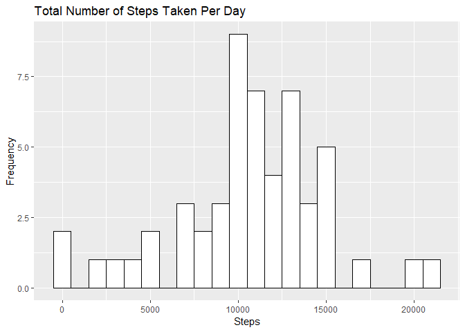
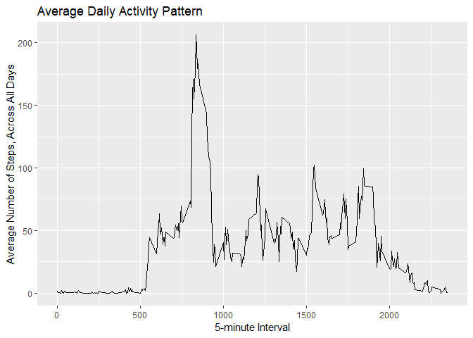
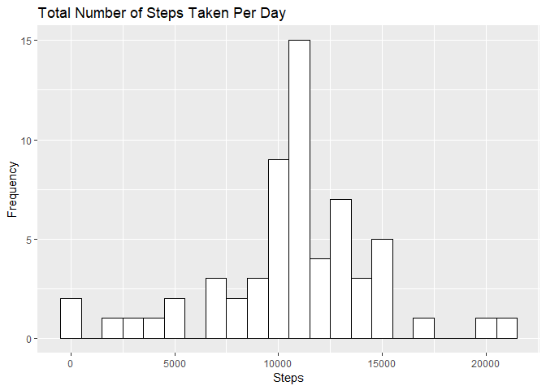
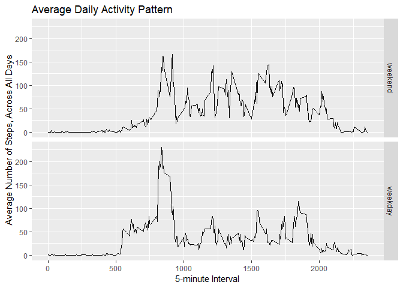

## Loading necessary packages
  
Use install.packages() if you don't already have these packages in your R library.
  

```r
library(lubridate)
library(dplyr)
library(ggplot2)
```
  
## Loading and preprocessing the data
  
Unzip and read in the .csv file to load the data into R.
  

```r
##unzip("activity.zip")
activity <- read.csv("activity.csv")
df <- activity
```
  
Convert the "date" values from Factor to POSIXct format.
  

```r
df$date <- ymd(df$date)
```
  
## What is mean total number of steps taken per day?
  
Create a dataframe that sums up the number of steps taken per day.
  

```r
df1 <- df %>%
  filter(!is.na(steps)) %>%
  group_by(date) %>%
  summarize(steps = sum(steps))
```
  
Using this summarized data, create a histogram of total number of steps taken each day.
  

```r
ggplot(df1, aes(steps)) +
  geom_histogram(binwidth = 1000, color = "black", fill = "white") +
  labs(title = "Total Number of Steps Taken Per Day", x= "Steps", y = "Frequency")
```

<!-- -->
  
Using this summarized data, find the mean and median of the total number of steps taken per day.
  

```r
mean(df1$steps)
```

```
## [1] 10766.19
```

```r
median(df1$steps)
```

```
## [1] 10765
```
  
## What is the average daily activity pattern?
  
Create a dataframe that takes the average number of steps per 5-minute interval, across all days.
  

```r
df2 <- df %>%
  filter(!is.na(steps) & !is.na(interval)) %>%
  group_by(interval) %>%
  summarize(steps = mean(steps))
```
  
Using this summarized data, create a times series plot of the 5-minute interval (x-axis) and the average number of steps taken, averaged across all days (y-axis).
  

```r
ggplot(df2, aes(interval, steps)) +
  geom_line() +
  labs(title = "Average Daily Activity Pattern", x= "5-minute Interval", y = "Average Number of Steps, Across All Days")
```

<!-- -->
  
Using this summarized data, find the 5-minute interval, on average across all the days in the dataset, that contains the maximum number of steps.
  

```r
as.data.frame(df2[which(df2$steps == max(df2$steps)),])
```

```
##   interval    steps
## 1      835 206.1698
```
  
## Imputing missing values
  
Find the total number of missing values in the data set.
  

```r
sum(is.na(df))
```

```
## [1] 2304
```
  
Create a new dataset, where the NA values are filled in using the mean for the given 5-minute interval.
  

```r
df3 <- left_join(df, df2, by = "interval", suffix = c("", ".mean"))
df3$steps[is.na(df3$steps)] <- df3$steps.mean[is.na(df3$steps)]
df3 <- df3 %>%
  select(date, steps) %>%
  group_by(date) %>%
  summarize(steps = sum(steps))
```
  
Using this summarized data, create a histogram of total number of steps taken each day.
  

```r
ggplot(df3, aes(steps)) +
  geom_histogram(binwidth = 1000, color = "black", fill = "white") +
  labs(title = "Total Number of Steps Taken Per Day", x= "Steps", y = "Frequency")
```

<!-- -->
  
Using this summarized data, find the mean and median of the total number of steps taken per day.
  

```r
mean(df3$steps)
```

```
## [1] 10766.19
```

```r
median(df3$steps)
```

```
## [1] 10766.19
```
  
The mean and median do not change significantly after filling in the missing data.
  
The missing data appears to only affect certain dates. We can see this by calculating the difference between the daily total steps with and without NAs.
  

```r
df4 <- left_join(df3, df1, by = "date", suffix = c(".na", ".no.na"))
df4 <- df4 %>%
  mutate(diff = as.numeric(steps.na)-as.numeric(steps.no.na)) %>%
  filter(diff != 0 | is.na(diff))
print(as.data.frame(df4))
```

```
##         date steps.na steps.no.na diff
## 1 2012-10-01 10766.19          NA   NA
## 2 2012-10-08 10766.19          NA   NA
## 3 2012-11-01 10766.19          NA   NA
## 4 2012-11-04 10766.19          NA   NA
## 5 2012-11-09 10766.19          NA   NA
## 6 2012-11-10 10766.19          NA   NA
## 7 2012-11-14 10766.19          NA   NA
## 8 2012-11-30 10766.19          NA   NA
```
  
As shown, the only dates where the difference isn't 0 are the dates when there were no values recorded at all. Thus, inputting the missing data only changed the total daily number of steps for dates without data in the first place.
  
## Are there differences in activity patterns between weekdays and weekends?
  

```r
## Create dataframe where the NA values are filled in using the mean for the given 5-minute interval
df5 <- left_join(df, df2, by = "interval", suffix = c("", ".mean"))
df5$steps[is.na(df5$steps)] <- df5$steps.mean[is.na(df5$steps)]

## Add variable that shows the day of week
weekdays <- c('Monday', 'Tuesday', 'Wednesday', 'Thursday', 'Friday')
df5$dayofweek <- factor((weekdays(df5$date) %in% weekdays), 
         levels=c(FALSE, TRUE), labels=c('weekend', 'weekday'))

## Find average steps, split by interval and day of week
df5 <- df5 %>%
  select(interval, steps, dayofweek) %>%
  group_by(interval, dayofweek) %>%
  summarize(steps = mean(steps))

## Plot interval and steps, split by day of week
ggplot(df5, aes(interval, steps)) +
  geom_line() +
  facet_grid(rows = vars(dayofweek)) +
  labs(title = "Average Daily Activity Pattern", x= "5-minute Interval", y = "Average Number of Steps, Across All Days")
```

<!-- -->
  
